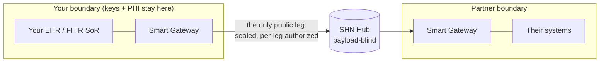

# shn-gateway

The **SHN Smart Gateway** is the software a participant runs to join the Smart
Health Network. Each organization — a provider, a payer, or another
participant — deploys its own gateway. The gateway holds that organization's
keys and exchanges healthcare data with other participants through the
**SHN Hub**, with every leg independently authorized and end-to-end encrypted.
The network is workflow-general; the first workflow delivered on it is Da
Vinci prior authorization.

- [1. Overview](#1-overview)
- [2. See it work — or deploy it](#2-see-it-work--or-deploy-it)
- [3. Request access](#3-request-access)
- [4. Quickstart: your first real green run](#4-quickstart-your-first-real-green-run)
- [5. Choose your path](#5-choose-your-path)
- [6. Going to production](#6-going-to-production)
- [7. Troubleshooting](#7-troubleshooting)
- [8. Reference & further reading](#8-reference--further-reading)

---

## 1. Overview

The gateway is **config-only**: a single published image, pointed at the SHN
discovery endpoint, with your registration bundle mounted. The common
integration case needs no code — connectors handle the rest.

Why this is different:

- **Config-only for the common case.** Point the image at your FHIR system of
  record and your registration bundle; there's nothing to build for the usual
  path.
- **You hold your keys.** Keys are generated client-side when you register —
  your private keys never leave your machine.
- **PHI never leaves your boundary.** Your clinical data is read, validated,
  and sealed inside your own gateway. Nothing about your patients is ever
  hosted by SHN.
- **The Hub is payload-blind.** SHN operates the Hub that routes sealed
  envelopes between participants — it authenticates and routes, but never
  sees the plaintext content of an exchange.
- **Every leg is independently authorized.** Each step of a multi-step
  exchange (eligibility, CRD, DTR, PAS, …) is separately checked against the
  Authorization Framework — no leg rides on another leg's authority.



The **only** public-internet leg in this picture is gateway↔Hub. Your EHR/FHIR
system of record, your keys, and (on the payer side) your adjudicator all talk
to your own gateway privately, inside your boundary — the Hub never sees them,
and neither does your counterpart's gateway.

---

## 2. See it work — or deploy it

Two ways to encounter a real Smart Gateway, both gated by the same developer
account (§3):

**Door 1 — see it work: the SHN Kit.**
[`shn-kit`](https://github.com/SmartHealthNetwork/shn-kit) is a signed,
download-and-go desktop app. It runs the real gateway binary on your machine,
drives all eight prior-authorization scenarios through the live Hub against a
hosted evaluation payer, and shows you every sealed leg in a flow inspector as
it happens. It signs in with your developer account and provisions its own
client. This is **evaluation, not deployment**: provider role only, synthetic
members, torn down when you quit. "Download-and-go" means no infrastructure to
stand up — not no account.

**Door 2 — deploy it: this guide.** Stand up a persistent participant —
provider or payer — that stays part of the network. Start with
[§4 Quickstart](#4-quickstart-your-first-real-green-run) for the fastest path
to a real green run, then [§5 Choose your path](#5-choose-your-path) to
connect your own systems.

Both doors require an **approved SHN developer account** first — see below.

---

## 3. Request access

Every path into the network — the Kit or a deployed gateway — starts with the
same gate: an **SHN developer account**.

1. **Submit the request-access form** at `https://developers.shn-preview.org`
   — no account needed to submit it.
2. **Wait for approval.** You'll get an email once your organization is
   approved.
3. **Sign in and set your password.** The approval email carries a temporary
   password; sign in at the developer portal and set a real one.
4. **Register a client and receive your secrets bundle.** Once signed in, use
   the `shn` CLI (from the public [`shn-sdk`](https://github.com/SmartHealthNetwork/shn-sdk))
   to register your organization and generate its keys:

   ```sh
   shn login --accounts https://accounts.shn-preview.org
   shn register --accounts https://accounts.shn-preview.org \
     --role provider --name your-org --base-url https://your-org.example.com \
     -out ./your-bundle
   ```

   Keys are generated **client-side** — your private keys never leave your
   machine. The `-out` directory is the **secrets bundle** every gateway below
   expects as `SHN_SECRETS`. (A **responder** role — `payer`, `facility`,
   `phg` — must register a `--base-url` that's genuinely, publicly reachable:
   the Hub dials it. See [§5 Payer](#payer).)

SHN is currently in a preview phase: use only synthetic data — never
production PHI — until told otherwise. When SHN reaches production, the only
thing that changes is which discovery URL you point at (§6); nothing else
about the gateway does.

### While you wait

Approval isn't instant. None of the following needs an account:

- Read `PARTICIPANT_PROTOCOL.md` in
  [`shn-sdk`](https://github.com/SmartHealthNetwork/shn-sdk) — the wire
  contract this gateway implements.
- Skim [§5 Choose your path](#5-choose-your-path) for your role, so you know
  what you're configuring once you're in.
- Clone this repository and build the gateway image
  (`docker build -t shn-gateway .`) — it's a public image; no invite needed to
  pull or build it.
- Pre-stage your configuration against
  [`docs/CONFIGURATION.md`](docs/CONFIGURATION.md) — which env vars you'll
  set, where your FHIR system of record lives.

The Kit needs this same account too — there's no lighter-weight way in.

---

## 4. Quickstart: your first real green run

**Prerequisite:** an approved developer account and a provisioned secrets
bundle (§3), registered with `--role provider`.

The fastest way to see a real result is the **bundled provider evaluation
stack**: the real gateway image, a pre-seeded FHIR server standing in for your
system of record, and a reference Da Vinci requester, wired together with
Docker Compose. It originates all eight prior-authorization scenarios through
the live Hub to a hosted evaluation payer — genuine per-leg authorization, a
real audit trail, real profile validation, not a local loopback.

```sh
git clone https://github.com/SmartHealthNetwork/shn-gateway.git
cd shn-gateway/deploy/eval

# Step 1 — build the reference requester (pinned upstream source; several minutes the first time)
bash brprovider/build.sh build

# Step 2 — bring up the bundle, pointing at your secrets bundle from §3
SHN_SECRETS=/abs/path/to/your-provider-bundle docker compose -f compose.eval.yml up --build
```

The seeded FHIR server's first boot can take up to ~20 minutes while it
indexes implementation guides — let it run; later runs come back in seconds.
Once everything reports ready, all eight use cases run green against the
hosted evaluation payer. Full detail, first-run costs, and the
production-cutover path: [`deploy/eval/README.md`](deploy/eval/README.md).

---

## 5. Choose your path

A real deployment connects the gateway to systems you operate. Which path fits
depends on whether you're originating exchanges (a provider) or responding to
them (a payer).

### Provider

Most providers aren't Da Vinci-conformant yet — **lead with `provider-data`**:
point the gateway at your plain FHIR system of record and it originates fully
conformant CRD → DTR → PAS exchanges on your behalf, with no Da Vinci client
of your own required.

```sh
docker run --rm \
  -e SHN_DISCOVERY_URL=https://accounts.shn-preview.org/discovery \
  -e ROLE=provider -e ORIGINATION_PROFILE=provider-data \
  -e FHIR_DATA_URL=https://fhir.your-org.example.com/r4 \
  -e PROVIDER_DTR_POPULATE_URL=https://your-populate-engine.example.com/fhir \
  -e FHIR_VALIDATE_URL=http://validator:8080/fhir \
  -e SHN_SECRETS=/etc/shn/bundle \
  -v "$PWD/your-bundle:/etc/shn/bundle:ro" \
  -p 8080:8080 \
  shn-gateway
```

**Routing is coverage-derived, not configured.** By default the gateway
resolves every payer leg's recipient from the member's own `Coverage.payor`
identity against the network's `/holders` feed (`FeedPayerRouter`) — there is
no default payer, and a new payer holder becomes reachable the moment it
publishes its identity, with no config change on your side. Resolution fails
closed: no match, or more than one holder claiming the same identity, is a
`422`. Set `PAYER_DIRECTORY` only to override this with a static map — useful
for bootstrap/testing, or a payer that hasn't published into the feed yet.
See [`docs/CONFIGURATION.md`](docs/CONFIGURATION.md#per-role).

**Already Da Vinci-conformant? Point your EHR at the gateway's own ingress
instead.** Set `PROVIDER_DAVINCI_INGRESS=1` and the gateway accepts native CDS
Hooks order-select (CRD), `Questionnaire/$questionnaire-package` (DTR), and
`Claim/$submit` (PAS) directly from your EHR or reference implementation,
authenticated via SMART Backend Services from a set of clients you
pre-register in `INGRESS_CLIENTS_FILE`. This is an equally supported,
goal-state path — not a fallback. **This ingress is a private,
within-boundary surface**, exactly like your FHIR system of record: the
gateway's only public-internet leg is the gateway↔Hub connection (§1); your
EHR calls this ingress from inside your own network, never across the public
internet. See
[`docs/INTEGRATION.md`](docs/INTEGRATION.md#native-da-vinci-ingress) for the
full setup.

Verify a provider is wired correctly with a real round trip:

```sh
curl -s -X POST localhost:8080/scenario/uc01 \
  -H 'Content-Type: application/json' -d '{"branch":"covered"}'
# → {"covered":true,"reason":""}

curl -s -X POST localhost:8080/scenario/uc03 \
  -H 'Content-Type: application/json' -d '{}'
# → {"paRequired":true,"authNumber":"…","validUntil":"…"}
```

These `/scenario/ucNN` routes are an **operator surface for driving and
testing your own gateway** — never expose them on the public internet; the
Hub never calls them. Full field reference:
[`docs/CONFIGURATION.md`](docs/CONFIGURATION.md); full integration
walkthrough: [`docs/INTEGRATION.md`](docs/INTEGRATION.md).

### Payer

A payer gateway is a **responder**: `ROLE=payer` mounts
`POST /substrate/inbound` — where the Hub delivers exchanges for you to
adjudicate, authenticating every call — plus the CMS-0057 Patient Access
surface (`GET /metadata`, `GET /ExplanationOfBenefit`). (`facility` and `phg`
are the same responder shape, for federated-query and patient-directed
exchanges respectively.)

**Decisioning — three options, in increasing order of ownership:**

1. **A local bundled reference payer** (the evaluation bundle's default,
   below) — see conformant Da Vinci decisioning behavior with nothing of your
   own to stand up.
2. **Native-forward to your own Da Vinci endpoint** (`PAYER_DAVINCI_*`) — the
   gateway forwards CRD/DTR/PAS to a Da Vinci-conformant service you already
   run.
3. **A custom `engine.Config.Adjudicator`** — the stable seam for your own
   coverage and medical-necessity policy, for decisioning that doesn't speak
   Da Vinci natively. See [`STABILITY.md`](STABILITY.md).

**Proving it works is deploy-and-test, not a laptop loopback.** A payer is
dialed, not dialing: the Hub `POST`s to your registered
`baseURL + /substrate/inbound`, so a payer must be reachable at a real public
https endpoint before any exchange can reach it — the registrar refuses to
register a private or loopback `baseURL`, and the Hub can't reach one even if
it were registered. So the self-test is:

1. **Deploy the payer evaluation bundle** — the real gateway image,
   `ROLE=payer`, native-forwarding to a co-bundled reference Da Vinci payer —
   to a reachable https endpoint (your own infrastructure, or a tunnel like
   `cloudflared`/`ngrok` for a quick eval). See
   [`deploy/eval/payer/README.md`](deploy/eval/payer/README.md).
2. **Register that deployment's public `baseURL`** with
   `shn register --role payer` (§3) — a laptop-only URL can't register.
3. **Drive it from a provider originator.** Run the provider evaluation bundle
   (§4) with `PAYER_HOLDER_ID` set to your payer's holder id, and drive it
   with `shn send-test --gateway <provider-url>` — a thin CLI in `shn-sdk`
   that fires all eight `/scenario/ucNN` routes and tabulates pass/fail. Every
   decision in the result comes from **your** payer.

Full bundle detail and the reachability options:
[`deploy/eval/payer/README.md`](deploy/eval/payer/README.md); full
decisioning walkthrough:
[`docs/INTEGRATION.md`](docs/INTEGRATION.md#payer-decisioning).

---

## 6. Going to production

The gateway you evaluate is the same gateway you run in production — moving
from a bundle to production is a matter of what's plugged into it, not a
different build.

- **One variable flips environments.** `SHN_DISCOVERY_URL` is the single
  anchor that resolves the Hub, Authorization Framework, registrar, and every
  trust anchor. Point it at the production discovery endpoint and nothing
  else about the gateway changes.
- **Co-locate your validator.** The gateway refuses to start without a FHIR
  `$validate` endpoint (FR-36). Run it as a sidecar inside your own boundary
  so PHI-bearing resources never leave it to be validated —
  [`deploy/bundle/`](deploy/bundle/README.md) ships this wiring ready-made.
- **Run as non-root.** The published image runs as uid/gid 65532
  (distroless); a self-mounted bundle needs `0750`/`0640` permissions with
  matching group ownership.
- **Durable state, if you pend claims.** The gateway boots on an in-memory
  store by default — including in PAS-native payer mode. Set
  `SHN_STORE_DATABASE_URL` to a Postgres DSN so in-flight (pended/resumable)
  claim state survives restarts and replicas — recommended for a production
  PAS-native payer, where pended-claim state must outlive any single instance.
- **Networking.** `PORT`/`HOST` control what the gateway binds to; beyond
  that, the only topology decision is the one your role already implies (a
  provider is outbound-only; a responder needs a public https address, per
  §5).

The complete environment-variable reference — everything above and everything
role-specific — is [`docs/CONFIGURATION.md`](docs/CONFIGURATION.md).

---

## 7. Troubleshooting

| Symptom | Cause and fix |
|---|---|
| `refusing to run without per-message validation (FR-36)` at startup | No validator configured and discovery advertises none. Set `FHIR_VALIDATE_URL`, or `SHN_FAKE_VALIDATOR=1` for a dev smoke. |
| `fetch discovery: …` / `fetch hub transport key: …` at startup | `SHN_DISCOVERY_URL` unreachable, or the gateway can't reach the hosts discovery resolves (Hub, Authorization Framework, registrar, …). Confirm `curl $SHN_DISCOVERY_URL` works from the gateway's network. |
| Provider originate returns `recipient "…" not in registry` | The payer holder resolved from the member's Coverage (feed `payerIds`, or your `PAYER_DIRECTORY` override) isn't a registered holder, or the registrar feed hasn't propagated yet. Confirm the counterpart appears in `shn clients` / the `/holders` feed. |
| Provider originate returns `422 no payer identifier on member coverage` / `no registered payer for identifier …` | Coverage-derived routing found no route (FR-G41; no default): the member's Coverage carries no parseable payor identity, or no `role=payer` holder in the feed claims that identity (and no `PAYER_DIRECTORY` override maps it). Ensure the target payer holder published that `{system,value}` in its feed `payerIds` (payer-onboarding path), or set a `PAYER_DIRECTORY` override row. An identity claimed by **two** holders also fails closed (ambiguous — `AI-G12`). |
| Provider originate returns `502` (routing / response sender mismatch) | The counterpart isn't reachable or didn't respond as itself. Check the payer gateway is running and its registered `--base-url` resolves publicly to it. |
| Payer never receives a delivery | The Hub can't reach the payer's `--base-url`. It must be a public https endpoint fronting `:8080` and must not redirect on `/substrate/inbound`. Re-check the tunnel/load balancer. |
| Payer returns `403 missing or invalid hub assertion` | The request didn't come from the Hub (e.g. a direct curl to `/substrate/inbound`). Only the Hub can deliver; originate from a provider instead. |
| Scenario call returns `400 unknown branch` / `unknown member` | The originate body must be `{"branch":"covered"}` or `{"branch":"notcovered"}`; the member must exist in the active system of record (the built-in stub carries example personas). |
| Permission-denied reading the bundle (Docker) | The mounted bundle isn't readable by gid 65532. Apply `chgrp -R 65532` + `0750`/`0640` (§6). |
| Registration rejected with `invalid baseURL: …` | `--base-url` must be a publicly resolvable https URL — not private/loopback/link-local. See [§3](#3-request-access) and [§5 Payer](#payer). |
| `egress validation failed` (422) on originate | The resource your connector produced doesn't conform to its IG profile. Check the `issues` array in the response; fix the data your `SystemOfRecord` returns. |

---

## 8. Reference & further reading

- [`docs/CONFIGURATION.md`](docs/CONFIGURATION.md) — the complete
  environment-variable reference.
- [`docs/INTEGRATION.md`](docs/INTEGRATION.md) — connecting your systems end
  to end: FHIR system of record, provider-data origination, native Da Vinci
  ingress, payer decisioning, custom connectors.
- [`STABILITY.md`](STABILITY.md) — versioning policy and which seams
  (`engine.Config.Adjudicator`, `engine.Config.SoR`, …) are safe to depend on
  across versions.
- [`SECURITY.md`](SECURITY.md) — vulnerability reporting.
- [`CONTRIBUTING.md`](CONTRIBUTING.md) — how this snapshot relates to the
  internal platform repo, and how to reach us.
- [`deploy/bundle/README.md`](deploy/bundle/README.md) — the production
  install unit (gateway + co-located validator).
- [`connectors/scaffold/README.md`](connectors/scaffold/README.md) — build a
  custom `SystemOfRecord` connector for a non-FHIR backend.
- [`shn-sdk`](https://github.com/SmartHealthNetwork/shn-sdk) — the public
  participant SDK and `shn` CLI. Its participant walkthrough (Discover →
  Register → Build → Run → Validate) and `PARTICIPANT_PROTOCOL.md` (the
  language-neutral wire contract) are the canonical participant references;
  this gateway implements that same contract.
- [`shn-kit`](https://github.com/SmartHealthNetwork/shn-kit) — the desktop
  app that runs a real gateway locally for evaluation (§2).
